# South Roast: an e-commerce website for a local coffee roaster

Developed by Benedict Amory Chambers
## Table of Contents

1. [Project Goals](#project-goals)
    1. [User Goals](#user-goals)
    2. [Site Goals](#site-goals)
2. [User Experience](#user-experience)
    1. [Target Audience](#target-audience)
    2. [User Stories](#user-stories)
3. [Design](#design)
    1. [Design Choices](#design-choices)
    2. [Colours](#colours)
    3. [Fonts](#fonts)
    4. [Structure](#structure)
    5. [Wireframes](#wireframes)
4. [Technologies](#technologies)
    1. [Languages](#languages)
    2. [Frameworks and Tools](#frameworks-and-tools)
5. [Features](#features)
6. [Testing](#testing)
    1. [HTML Validation](#HTML-validation)
    2. [CSS Validation](#CSS-validation)
    3. [JavaScript Validation](#javascript-validation)
    4. [Python Validation](#python-validation)
    4. [Accessibility](#accessibility)
    5. [Performance](#performance)
    6. [Compatibility](#compatibility)
    7. [Testing user stories](#testing-user-stories)
    8. [Automated tests](#automated-tests)
7. [Credits](#credits)
8. [Deployment](#deployment)
9. [Acknowledgements](#acknowledgements)

## Project Goals 

This is an e-commerce website for a fictional local coffee roasters that offers a variety of products and services, and encourages user interaction and repeat business by including social features and other benefits to registering for an account with the site. It focuses on making use of the Django framework to develop a full-stack website with a solid and user-friendly frontend, complete and facile backend integration, and that delivers a good experience for the user and site owner that meets the goals of both. 

### User Goals 

- Easy browsing of the products the user may be interested in purchasing
- A simple and easy checkout process to allow for easy purchases
- A way to view, update, and delete their data; both for previous orders and for community focused user-created content

### Site Goals

- Encourage browsing and repeat purchases by providing a pleasant and attractive user experience
- Build a relationship and familarity between the business and its customers 
- Allow for management of an online business presence to increase custom and make connections

### Developer Goals

- Create an accessible, responsive website that provides the full intended experience to a range of users
- Integrate a functional and sensible backend data model that serves the customer goals and the site owner needs
- Make good use of Django to build a complete, secure, full-stack website as a solo developer

## User Experience

### Target Audience

The target audiences for the website are new customers who are interested in the products offered, repeat customers who would like to further explore the products on offer and who would benefit from engaging with the business and its community more personally, and other local businesses who may be interested in establishing a beneficial wholesale relationship.

### User Stories
#### First Time User

1. Find out what the site has to offer and who it is for
2. Easily navigate around the site; access the Register, Community, About/Contact and Product pages
3. Search for products on the site
4. Add products to the shopping cart and easily update or remove them 
5. Checkout as a guest user 
6. Register for an account
7. Contact the business for a customer or wholesale query

#### Returning User

8. Log in to my account
9. Leave a review for a product
10. Post to the community tab
11. Review my previous orders
12. Update my default delivery info
13. Checkout more easily with my default delivery info
14. Delete my account

#### Site Owner:

15. Showcase all the products the business offers, sorted into categories
16. Allow for community engagement and feedback from customers
17. Easily add or remove products sitewide using the admin page
18. Ensure all orders are saved and completed properly

## Design 

### Design Choices

I have opted for a simple and consistent design across the site. Using bootstrap and custom classes, I have aimed at creating a cohesive style for the site that matches the tone of the business, as a small local coffee roasters. 

### Colours

In keeping with the coffee theme, I have chosen a dark brown background colour for headings and distinct sections, that stands out and complements the lighter brown coffee themed background. I chose to make this darker colour slightly transparent, so that it integrates a little better with the background image and with the soft aesthetic.

### Fonts

To maintain the professional consistency and cohesive aesthetic, I have used two fonts from the same family across the site. For the majority of the informative text, I used a simple and attractive font called [Cabin](https://fonts.google.com/specimen/Cabin). For display fonts in headings and logos, I used the friendly display variant, [Cabin Sketch](https://fonts.google.com/specimen/Cabin+Sketch).

### Structure

The site uses a persistent navigation bar to navigate between the main pages, with several more focused and detailed pages accessed from within the main pages.

1. Homepage - A landing page that demonstrates what the business is offering and establishes the site and user goals

2. Products - A complete list view of all products available. This can be filtered by a variety of categories to make finding the desired product easier. Additionally, in the navigation bar there is a search box by which the user can directly filter all products on the site with a search term.

3. Product Details - This page is accessed by selecting a product on the main Products page. It gives further information about the product offered, with reviews that are created by authorised users, and gives the option to add the product to the shopping cart for purchase.

4. Cart - Displays all products and quantities currently added to the user's cart, which is stored in the session. From here the user can update quantities or remove products.

5. Checkout - The checkout form for the site takes user details for completeing an order, and uses a Stripe card element to process payments securely, ensuring that orders can be completed and accessed even in the case of user or site error. 

6. Community Posts - This is a community focused page where users can post thoughts and images, engaging with the business and other customers. 

7. Account - Here the user can view their previous order history, update their default delivery info for easier checkouts, and delete their account if wished.

8. About/Contact - Simple breakdown of what the site offers both to regular and wholesale customers. Contains the contact form by which users can contact the business via email.

9. Sign In/Register - Pages for a new user to register an account or for an existing user to log back in to their account, built with django-allauth

10. 404 - Custom 404 page to redirect users to the homepage if they run into any errors on the site

### Wireframes
### Entity Relationship Diagram

Entity Relationship Diagram generated with [LucidChart](http://lucidchart.com/)

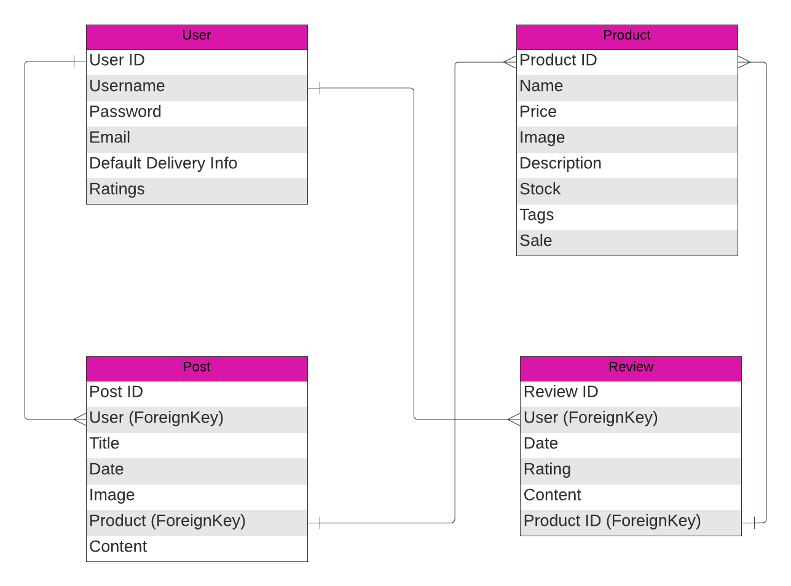

## Technologies

### Languages 

HTML5

CSS3

JavaScript

Python

### Frameworks and Tools

[django](https://www.djangoproject.com/)

[django-allauth](https://docs.allauth.org/en/latest/)

[django-star-ratings](https://pypi.org/project/django-star-ratings/)
For this project, I decided to fork and customise a version of the django-star-ratings package that focuses more on individual user ratings and reflects that in the accompanying front-end JavaScript.
[forked-django-star-ratings](https://github.com/amorychambers/django-star-ratings)

[jquery](https://jquery.com/)

[Bootstrap](https://getbootstrap.com/)

[Visual Studio Code](https://code.visualstudio.com/)

[Git](github.com)

[Heroku](heroku.com)

[Google Fonts](https://fonts.google.com/)

[Balsamiq](https://balsamiq.com/)

[Obsidian](https://obsidian.md/)

[Font Awesome](https://fontawesome.com/)

[Favicon](https://favicon.io/)

[W3C Markup Validation Service](https://validator.w3.org/)

[W3C CSS Validation Service](https://jigsaw.w3.org/css-validator/)

[JSHint](https://jshint.com/)

[CI Python Linter](https://pep8ci.herokuapp.com/)

[WebAIM Contrast Checker](https://webaim.org/resources/contrastchecker/)

[WAVE Web Accessibility Evaluation Tools](https://wave.webaim.org/)

## Features

### Header and Navigation

- Navigation bar present at the top of every page to allow intuitive and easy navigation
- Navbar collapses into a convenient hamburger menu on smaller screen sizes, and displays different options for logged in users and guests
- Search Bar for filtering products by search terms
- Cart button that updates in real time to show how many items the user has in their cart and links to the cart view page

User Stories: 2, 3

### Sign In and Registration

- Sign In and Registration pages use django-allauth forms to allow users to create a new account entry in the database and to access an account they have already created
- Form validation built in with django-allauth, along with additional options for forgotten passwords

User Stories: 6, 8

### Products

- Complete list of products available that can be easily updated with new or deleted products in the admin panel
- Filtering options for products with different tags
- User created product reviews that can be posted and updated by authorised users from the details page

User Stories: 1, 3, 4, 9, 15, 16

### Reviews & Star Ratings

- Up-to-date average star ratings from user ratings on all products, with specific user ratings associated with user reviews and profiles
- User created reviews on all product pages with dates and ratings

### Cart & Checkout

- Dynamically updating subtotals with easy quantity selectors and item removal option 
- Stripe payments for easy and convenient payment processing on all orders
- Default delivery info option for registered users
- Webhooks to ensure orders can be processed and saved in the event of any errors

User Stories: 4, 5, 13

### User Profile

- Complete user order history that can be viewed in detail
- Default delivery information form that can be updated by the user

User Stories: 11, 12, 14

### Community Posts

- Community engagement page allowing for text and image posts from registered users

User Stories: 2, 10, 16

### Contact Form 

- Easy method to contact site owners for queries via email

User Stories: 7

## Testing

### HTML Validation

Validated with the W3C Markup Validation Service

As I have used templating and jinja2 code in the HTML file, it was not possible to validate them by file upload. In order to validate these pages, I have opened the page whilst logged in to the site, copied the fully loaded page's source code, and pasted it into the HTML validator.

cart/cart.html - No errors listed

checkout/checkout.html - One error listed for a label that does not match a form check input when the user is not logged in. This is created by the crispy-forms package, which dynamically renders the form check input for logged in users and links to the login page for guest users, leaving the label untouched. 

checkout/checkout_success.html - No errors listed

contact/contact.html - No errors listed

index.html - No errors listed

posts/posts.html - No errors listed
posts/create_post.html - No errors listed

products/products.html - All errors listed in the validator relate to the code generated by the django-star-ratings package, so I am leaving them unchanged
products/product_details.html - All errors listed in the validator relate to the code generated by the django-star-ratings package, so I am leaving them unchanged

profile/profile.html - No errors listed

reviews/review.html - All errors listed in the validator relate to the code generated by the django-star-ratings package, so I am leaving them unchanged

### CSS Validation

Validated with the W3C CSS Validation Service

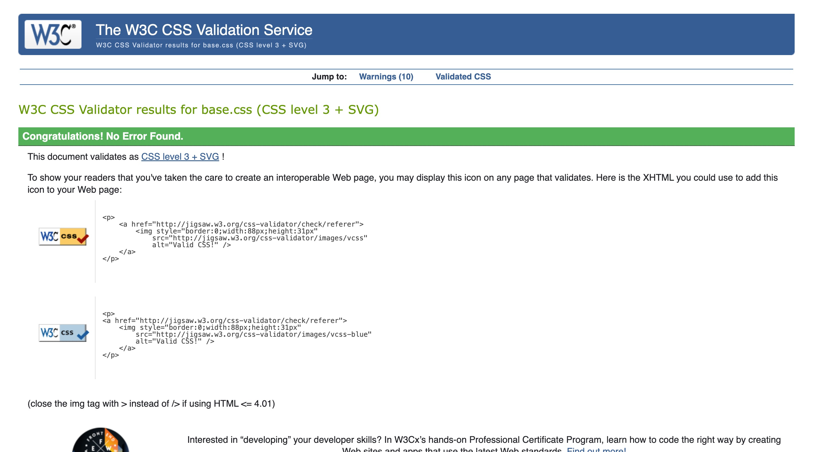

No errors listed

No errors listed

### JavaScript Validation

Validated with JSHint

cart-collection.js - No errors listed

delete-account.js - No errors listed

flushed-footer.js - No errors listed

header-toggle.js - No errors listed

quantity-input.js - No errors listed

stripe-elements.js - No errors listed

### Python Validation

Validated with Code Institute's CI Python Linter

cart/contexts.py - No errors listed
cart/views.py - No errors listed

checkout/forms.py - No errors listed
checkout/models.py - No errors listed
checkout/signals.py - No errors listed
checkout/views.py - No errors listed
checkout/webhook_handler.py - One error listed: lines 82 and 83 are 80 characters long. As these are over PEP8 guidelines by only one character and are due to longer variable names, I have decided that any changes might decrease readability.
checkout/webhooks.py - One error listed: line 44 is over 80 characters long. Left unchanged for similar readability reasons as this is due to a long variable name taken from Stripe

contact/views.py - No errors listed
contact/forms.py - No errors listed

home/views.py - No errors listed

posts/forms.py - No errors listed
posts/models.py - No errors listed
posts/views.py - No errors listed

products/models.py - No errors listed
products/views.py - No errors listed

profiles/forms.py - No errors listed
profiles/models.py - No errors listed
profiles/views.py - No errors listed

reviews/forms.py - No errors listed
reviews/models.py - No errors listed
reviews/views.py - No errors listed

settings.py - One error listed. Password validator settings contain variables longer than can fit in 79 characters.

### Accessibility

Validated with the WAVE Web Accessibility Evaluation Tools

base.html - There are two accessibility errors generated on each page that extends base.html. These relate to an empty button and an empty link in the header, and is flagged due to the use of icons for the search box and shopping cart, rather than text. As there are icons on the page for both of these, I have decided to consider this a false positive and discount these specific errors from other pages' validation.

cart/cart.html - 3 errors listed. Two errors created by the use of icons inside buttons for the quantity selector, which are not picked up as inner content to the anchor element. One error listed for missing form label in quantity selector form input; I have decided not to label each quantity selector input as it is labelled by the table heading for 'Quantity'.

checkout/checkout.html - 8 errors listed on the page for input elements without labels. These elements use placeholder text in line with Stripe form styling, so I have not included additional labels copying over the placeholder text.

checkout/checkout_success.html - No errors listed

contact/contact.html - 4 errors listed on the page for input elements without labels. These elements use placeholder text in line with sitewide form styling, so I have not included additional labels copying over the placeholder text.

index.html - 5 errors for empty links. These elements make use of the Bootstrap stretched-links feature, which stretches the link to encompass the parent div, in this case, the figure elements. As these links are not empty, I have left these errors unaddressed. To address the two contrast errors, I have changed the heading texts on the carousel slides to use a black background, which resolves the contrast issue for the white text headings.

posts/posts.html - No errors listed
posts/create_post.html - No errors listed

products/products.html - Each product listed generates an empty link error for the same reason as the homepage's stretched links. As these links are functional and not empty, I have chosen to disregard this error type.
products/product_details.html - Two errors created by the use of icons inside buttons for the quantity selector, which are not picked up as inner content to the anchor element. 

profile/profile.html - 6 errors listed on the page for input elements without labels. These elements use placeholder text in line with sitewide form styling, so I have not included additional labels copying over the placeholder text.

reviews/review.html - 2 errors listed on the page for input elements without labels. These elements use placeholder text in line with sitewide form styling, so I have not included additional labels copying over the placeholder text. 10 errors listed for empty button elements, generated by the external django-star-ratings package. These buttons are functional parts of the star rating system, and as such I have not pursued any way of addressing this error directly.

### Performance

Performance testing by Google Lighthouse in Google Chrome Developer Tools

### Compatibility
### Testing User Stories

#### First-Time User

As a first-time user, I want to:

1. Find out what the site has to offer and who it is for

| **Feature** | **Action** | **Expected Result** | **Actual Result** |
| ---- | ---- | ---- | ---- |
| About | Navigate to About Page | Presented with information about the site | Works as expected |

Screen Capture

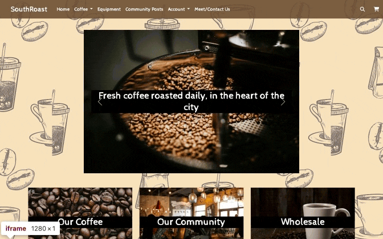

2. Easily navigate around the site; access the Register, Community, About/Contact and Product pages

| **Feature** | **Action** | **Expected Result** | **Actual Result** |
| ---- | ---- | ---- | ---- |
| Header and Navigation | Select pages from navbar | All links direct to the correct page | Works as expected |

Screen Capture

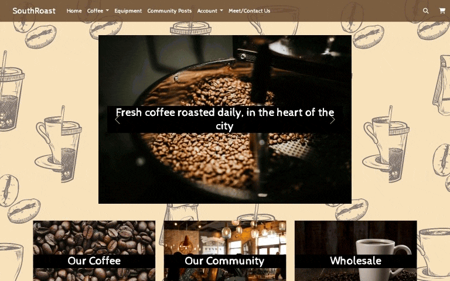

3. Search for products on the site

| **Feature** | **Action** | **Expected Result** | **Actual Result** |
| ---- | ---- | ---- | ---- |
| Header and Navigation | Enter search term | Site returns products with names and descriptions containing search term | Works as expected |

Screen Capture

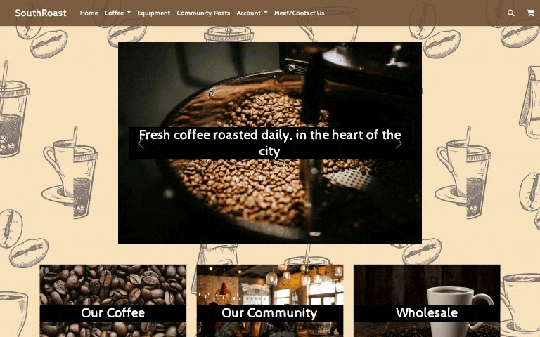

4. Add products to the shopping cart and easily update or remove them

| **Feature** | **Action** | **Expected Result** | **Actual Result** |
| ---- | ---- | ---- | ---- |
| Cart & Checkout | Enter search term | Site returns products with names and descriptions containing search term | Works as expected |

Screen Capture

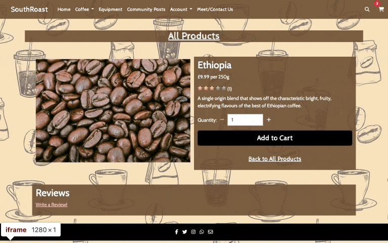

5. Checkout as a guest user

| **Feature** | **Action** | **Expected Result** | **Actual Result** |
| ---- | ---- | ---- | ---- |
| Cart & Checkout | Enter individual checkout details | Order is processed with single instance details provided | Works as expected |

Screen Capture

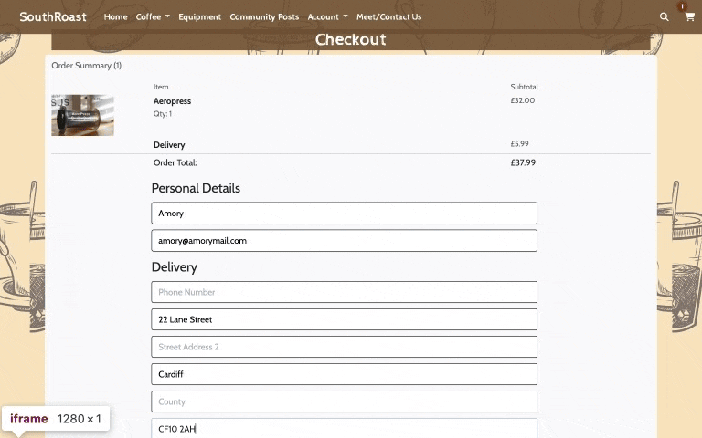

6. Register for an account

| **Feature** | **Action** | **Expected Result** | **Actual Result** |
| ---- | ---- | ---- | ---- |
| Sign In & Registration | Register with a new username and password | New user model is created in the database | Works as expected |

Screen Capture

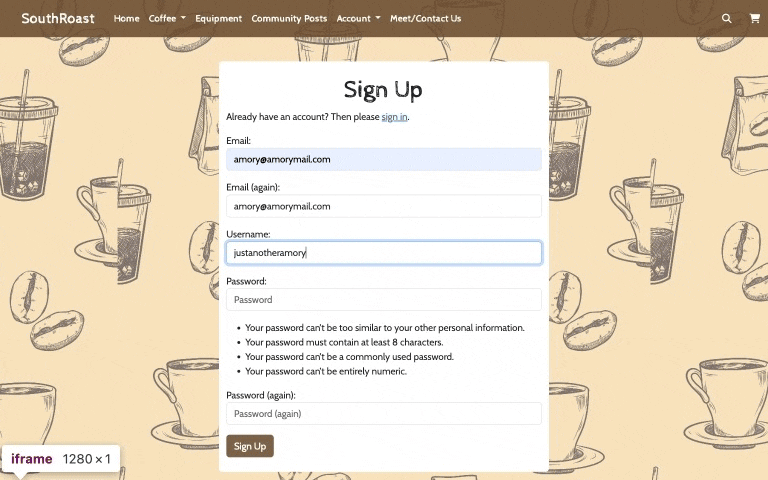

7. Contact the business for a customer or wholesale query

| **Feature** | **Action** | **Expected Result** | **Actual Result** |
| ---- | ---- | ---- | ---- |
| Contact Form | Submit a question via the form | Email sent to requested address with message contents | Works as expected |

Screen Capture

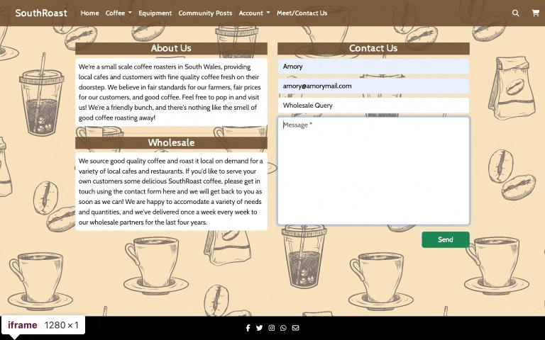

#### Returning User

8. Log in to my account

| **Feature** | **Action** | **Expected Result** | **Actual Result** |
| ---- | ---- | ---- | ---- |
| Sign In & Registration | Enter my user details | Log into site and access my data | Works as expected |

Screen Capture

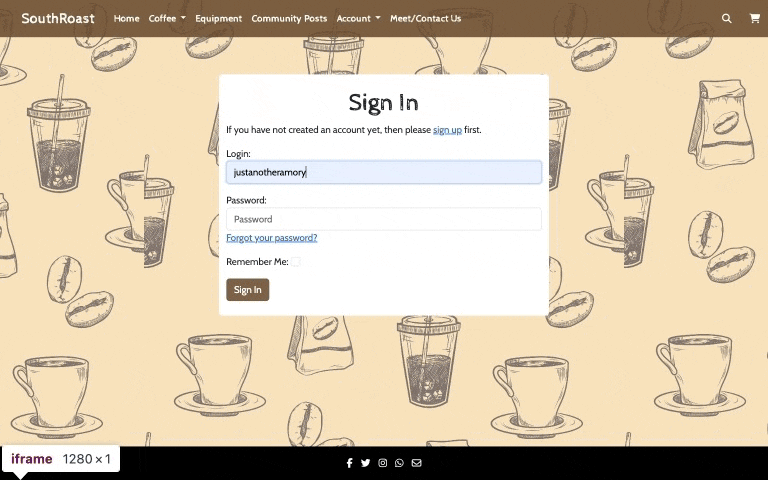

9. Leave a review for a product

| **Feature** | **Action** | **Expected Result** | **Actual Result** |
| ---- | ---- | ---- | ---- |
| Reviews & Star Ratings | Submit a new review using the review form | Review appears on product page with average star rating updated | Works as expected |

Screen Capture

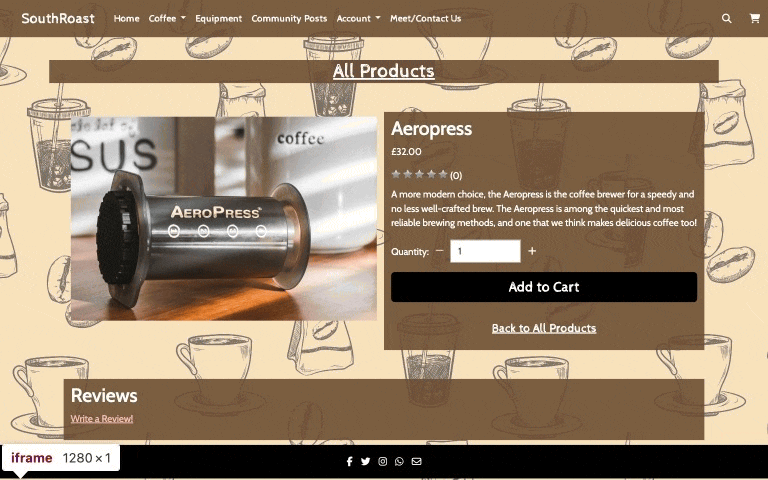

10. Post to the community tab

| **Feature** | **Action** | **Expected Result** | **Actual Result** |
| ---- | ---- | ---- | ---- |
| Community Posts | Submit a new post using the post form | Post appears on community page | Works as expected |

Screen Capture

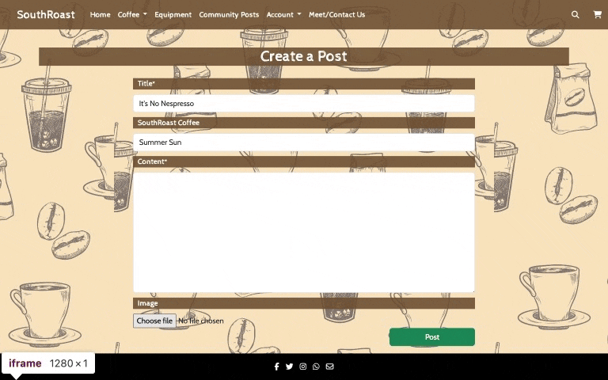

11. Review my previous orders

| **Feature** | **Action** | **Expected Result** | **Actual Result** |
| ---- | ---- | ---- | ---- |
| User Profile | Access order history from the My Account page | Returns complete list of orders with more detailed pages linked | Works as expected |

Screen Capture

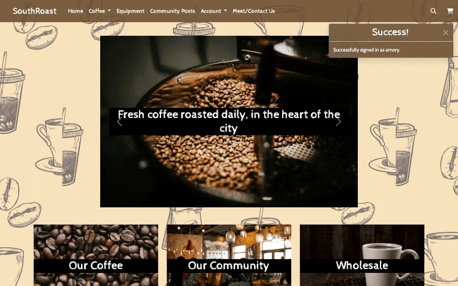

12. Update my default delivery info

| **Feature** | **Action** | **Expected Result** | **Actual Result** |
| ---- | ---- | ---- | ---- |
| User Profile | Submit delivery info form with new details | Default address is saved in database | Works as expected |

Screen Capture

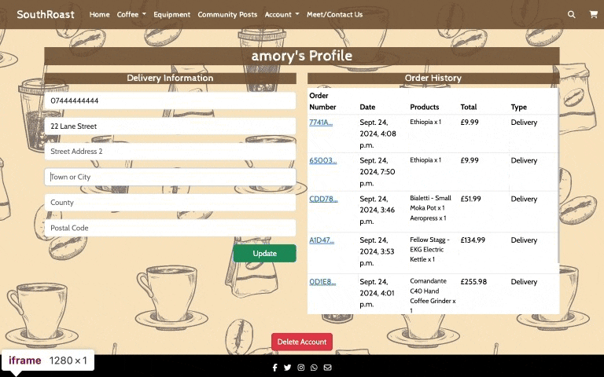

13. Checkout more easily with my default delivery info

| **Feature** | **Action** | **Expected Result** | **Actual Result** |
| ---- | ---- | ---- | ---- |
| Cart & Checkout | Open checkout page when signed in and with a default address saved in user profile | Default address info is already filled in from database | Works as expected |

Screen Capture

14. Delete my account

| **Feature** | **Action** | **Expected Result** | **Actual Result** |
| ---- | ---- | ---- | ---- |
| User Profile | Select and confirm the Delete Account option from user profile page | User profile and associated reviews, posts and data is deleted from database | Works as expected |

Screen Capture

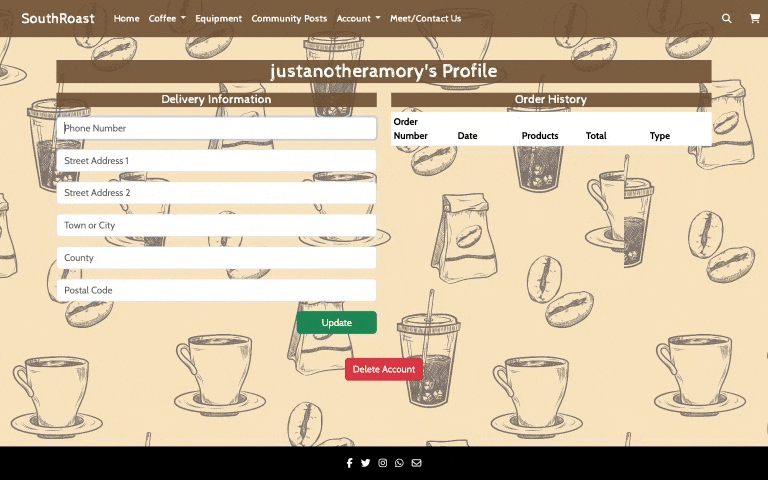

### Automated Tests 

## Credits

### Media

Background Image by [Cindynihart](https://pixabay.com/illustrations/coffee-beans-drink-cup-caffeine-5635765/)

'Our Coffee' Photo by [Igor Haritanovich](https://www.pexels.com/photo/coffee-beans-1695052/)

'Our Community' Photo by [On Shot](https://www.pexels.com/photo/people-in-cafe-2788792/)

'Seasonal Blends' Photo by Jessica Lewis @ [thepaintedsquare](https://www.pexels.com/photo/coffee-beans-on-top-of-the-wooden-surface-699373/)

'About' Photo by [Juan Pablo Serrano](https://www.pexels.com/photo/shallow-focus-photo-of-coffee-beans-894695/)

'Wholesale' Photo by [Toni Cuenca](https://www.pexels.com/photo/coffee-mug-surrounded-with-coffee-beans-585753/)

'Gift Sets' Photo by [Michael Burrows](https://www.pexels.com/photo/wooden-table-with-equipment-for-making-coffee-7125768/)

[Summer Vibes font](https://www.dafont.com/summer-vibes.font)

'Product 1' Photo by [Polina Tankilevitch](https://www.pexels.com/photo/brown-coffee-beans-in-close-up-photography-4109748/)

'Product 2' Photo by [Igor Haritanovich](https://www.pexels.com/photo/coffee-beans-1695052/)

'Product 3' Photo by [Pixabay](https://www.pexels.com/photo/pile-of-coffee-bean-164622/)

'Product 4' Photo by [Pixabay](https://www.pexels.com/photo/coffee-bean-lot-209443/)

'Product 5' Photo by [Roman Bengaiev](https://www.pexels.com/photo/coffee-beans-in-close-up-photography-3914189/)

'Product 6' Photo by [Elle Hughes](https://www.pexels.com/photo/brown-cup-beside-a-coffee-maker-4424674/)

'Product 7' Photo by [Juan Gomez](https://www.pexels.com/photo/black-coffee-press-on-wooden-table-3993825/)

'Product 8' Photo by [Hannoversche Kaffeemanufaktur](https://www.pexels.com/photo/close-up-shot-of-coffee-grinder-9623568/)

'Product 9' Photo by [onetoforseeforall](https://www.pexels.com/photo/close-up-of-person-making-filter-coffee-8469495/)

'Product 10' Photo by [interwebly io](https://www.pexels.com/photo/person-making-drip-coffee-11281128/)

### External Code

[Django Postgres Tutorial](https://stackpython.medium.com/how-to-start-django-project-with-a-database-postgresql-aaa1d74659d8)

Flushed Footer JS script from [Cory on StackOverflow](https://stackoverflow.com/a/36385654)

Filtering queryset for ModelChoiceField from [furins on StackOverflow](https://stackoverflow.com/questions/15608784/django-filter-the-queryset-of-modelchoicefield)

## Deployment

## Acknowledgements