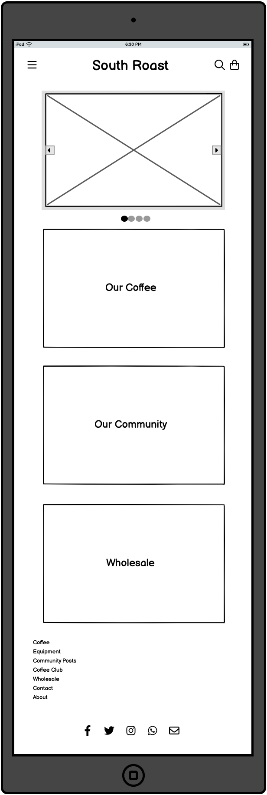
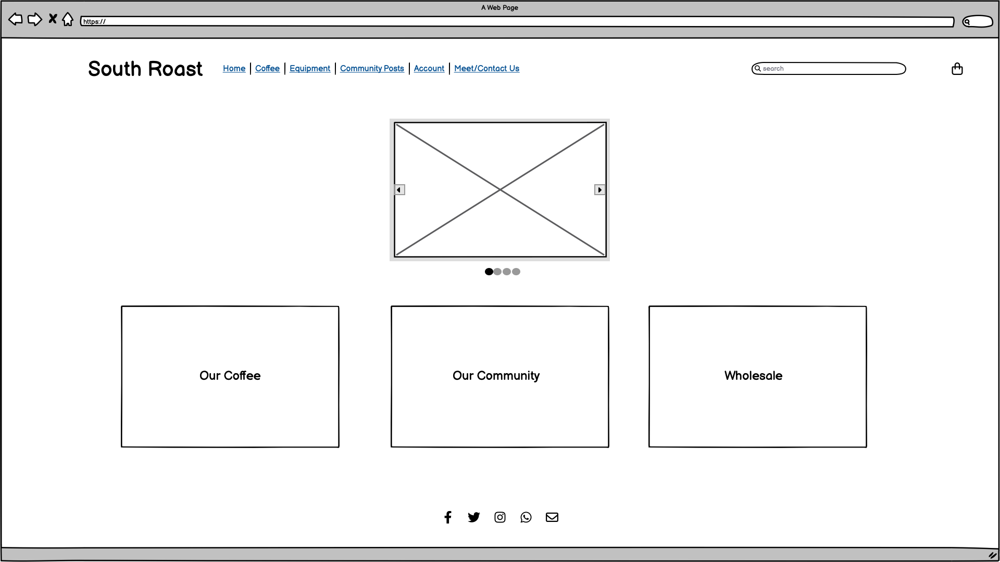
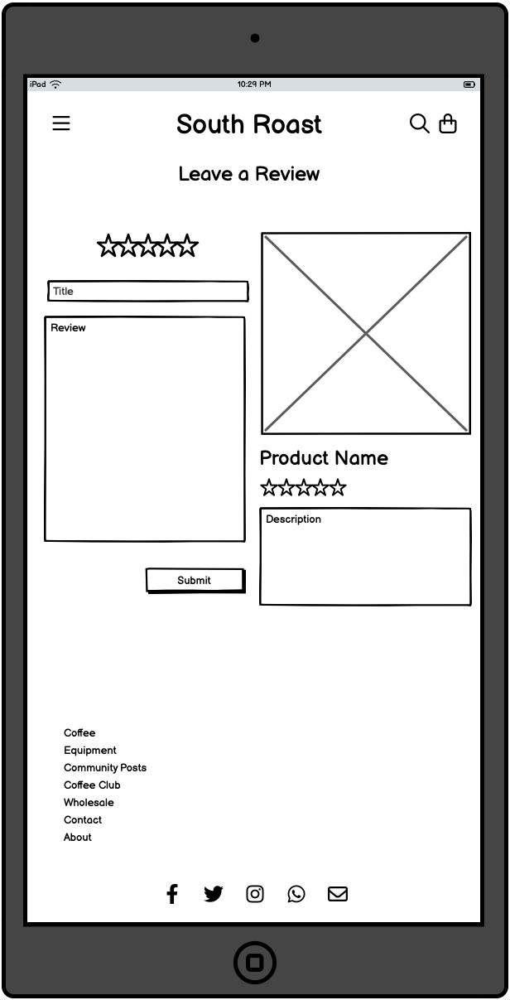
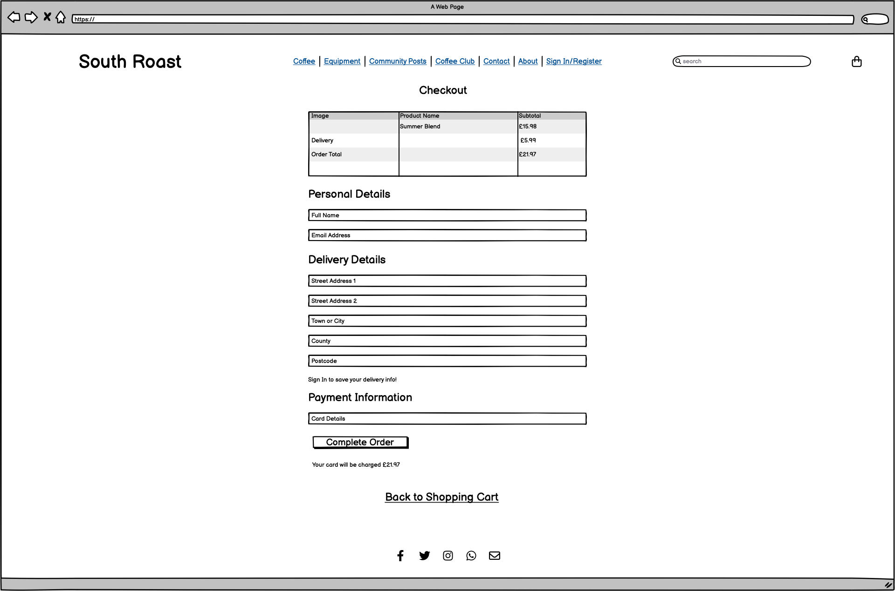
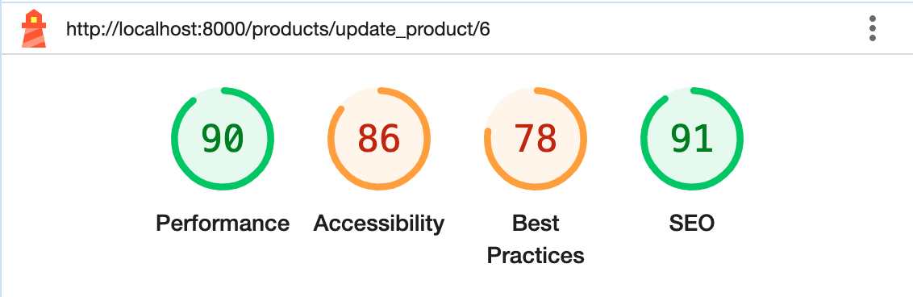
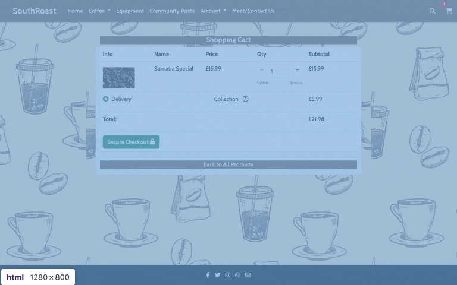
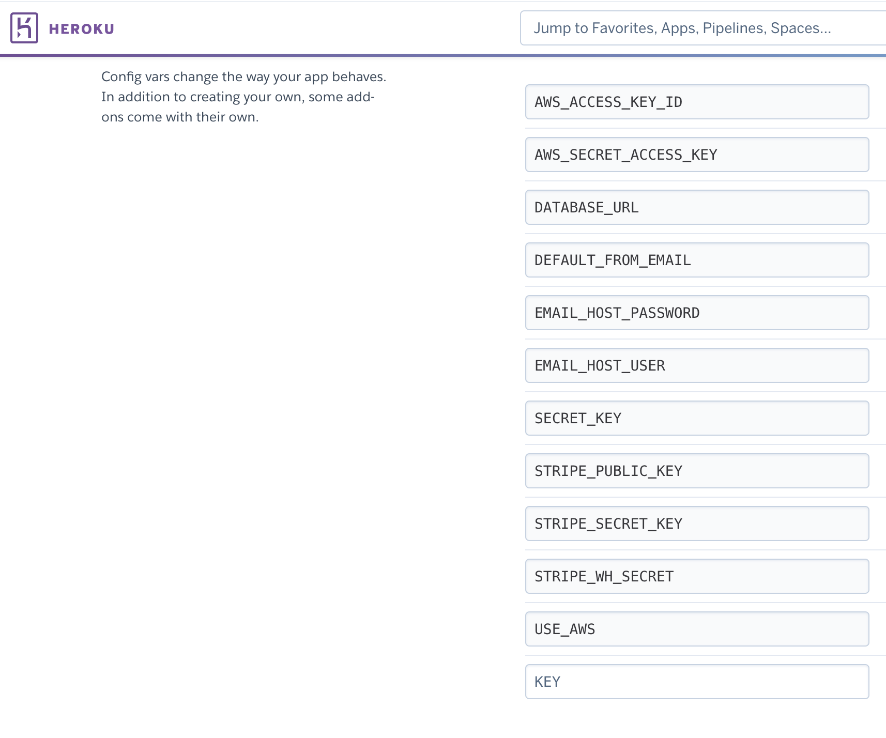

# South Roast: an e-commerce website for a local coffee roaster


Developed by Benedict Amory Chambers
## Table of Contents

1. [Project Goals](#project-goals)
    1. [User Goals](#user-goals)
    2. [Site Goals](#site-goals)
2. [User Experience](#user-experience)
    1. [Target Audience](#target-audience)
    2. [User Stories](#user-stories)
3. [Design](#design)
    1. [Design Choices](#design-choices)
    2. [Colours](#colours)
    3. [Fonts](#fonts)
    4. [Structure](#structure)
    5. [Wireframes](#wireframes)
4. [Technologies](#technologies)
    1. [Languages](#languages)
    2. [Frameworks and Tools](#frameworks-and-tools)
5. [Features](#features)
6. [Testing](#testing)
    1. [HTML Validation](#HTML-validation)
    2. [CSS Validation](#CSS-validation)
    3. [JavaScript Validation](#javascript-validation)
    4. [Python Validation](#python-validation)
    5. [Accessibility](#accessibility)
    6. [Performance](#performance)
    7. [Compatibility](#compatibility)
    8. [Testing user stories](#testing-user-stories)
    9. [Backend Testing](#backend-testing)
7. [Credits](#credits)
8. [Deployment](#deployment)
9. [Acknowledgements](#acknowledgements)

## Project Goals 

This is an e-commerce website for a fictional local coffee roasters that offers a variety of products and services, and encourages user interaction and repeat business by including social features and other benefits to registering for an account with the site. It focuses on making use of the Django framework to develop a full-stack website that has a solid and user-friendly frontend, complete and facile backend integration, and that delivers a good experience for the user and site owner which meets the goals of both. 

### User Goals 

- Easy browsing of the products the user may be interested in purchasing
- A simple and easy checkout process to allow for easy purchases
- A way to view, update, and delete their data; both for previous orders and for community focused user-created content

### Site Goals

- Encourage browsing and repeat purchases by providing a pleasant and attractive user experience
- Build a relationship and familarity between the business and its customers 
- Allow for management of an online business presence to increase custom and make connections

### Developer Goals

- Create an accessible, responsive website that provides the full intended experience to a range of users
- Integrate a functional and sensible backend data model that serves the customer's goals and the site owner's needs
- Make good use of Django to build a complete, secure, full-stack website as a solo developer

## User Experience

### Target Audience

The target audiences for the website are new customers who are interested in the products offered, repeat customers who would like to further explore the products on offer and who would benefit from engaging with the business and its community more personally, and other local businesses who may be interested in establishing a beneficial wholesale relationship.

### User Stories
#### First Time User

1. Find out what the site has to offer and who it is for
2. Easily navigate around the site; access the Register, Community, About/Contact and Product pages
3. Search for products on the site
4. Add products to the shopping cart and easily update or remove them 
5. Checkout as a guest user 
6. Register for an account
7. Contact the business for a customer or wholesale query


#### Returning User

8. Log in to my account
9. Leave a review for a product
10. Post to the community tab
11. Review my previous orders
12. Update my default delivery info
13. Checkout more easily with my default delivery info
14. Delete my account

#### Site Owner:

15. Showcase all the products the business offers, sorted into categories
16. Allow for community engagement and feedback from customers
17. Easily add or remove products sitewide using the admin page
18. Ensure all orders are saved and completed properly

## Design 

### Design Choices

I have opted for a simple and consistent design across the site. Using bootstrap and custom classes, I have aimed at creating a cohesive style for the site that matches the tone of the business, as a small local coffee roaster. 

### Colours

In keeping with the coffee theme, I have chosen a dark brown background colour for headings and distinct sections that stands out and complements the lighter brown coffee themed background. I chose to make this darker colour slightly transparent, so that it integrates a little better with the background image and with the soft aesthetic.

### Fonts

To maintain the professional consistency and cohesive aesthetic, I have used two fonts from the same family across the site. For the majority of the informative text, I used a simple and attractive font called [Cabin](https://fonts.google.com/specimen/Cabin). For display fonts in headings and logos, I used the friendly display variant, [Cabin Sketch](https://fonts.google.com/specimen/Cabin+Sketch).

### Structure

The site uses a persistent navigation bar to navigate between the main pages, with several more focused and detailed pages accessed from within the main pages.

1. Homepage - A landing page that demonstrates what the business is offering and establishes the site and user goals

2. Products - A complete list view of all products available. This can be filtered by a variety of categories to make finding the desired product easier. Additionally, in the navigation bar there is a search box by which the user can directly filter all products on the site with a search term.

3. Product Details - This page is accessed by selecting a product on the main Products page. It gives further information about the product offered, with reviews that are created by authorised users, and gives the option to add the product to the shopping cart for purchase.

4. Cart - Displays all products and quantities currently added to the user's cart, which is stored in the session. From here the user can update quantities or remove products.

5. Checkout - The checkout form for the site takes user details for completeing an order, and uses a Stripe card element to process payments securely, ensuring that orders can be completed and accessed even in the case of user or site error. 

6. Community Posts - This is a community focused page where users can post thoughts and images, engaging with the business and other customers. 

7. Account - Here the user can view their previous order history, update their default delivery info for easier checkouts, and delete their account if wished.

8. About/Contact - Simple breakdown of what the site offers both to regular and wholesale customers. Contains the contact form by which users can contact the business via email.

9. Sign In/Register - Pages for a new user to register an account or for an existing user to log back in to their account, built with django-allauth

10. 404 - Custom 404 page to redirect users to the homepage if they run into any errors on the site

### Wireframes

Wireframes created in Balsamiq

<details><summary>homepage</summary>



</details>

<details><summary>products</summary>


</details>

<details><summary>contact</summary>


</details>

<details><summary>post</summary>


</details>

<details><summary>review</summary>



</details>

<details><summary>signin</summary>


</details>

<details><summary>register</summary>


</details>

<details><summary>cart</summary>


</details>

<details><summary>checkout</summary>



</details>

<details><summary>checkout success</summary>


</details>

<details><summary>user profile</summary>


</details>

<details><summary>product details</summary>


</details>

<details><summary>community</summary>


</details>

<details><summary>404</summary>


</details>


### Entity Relationship Diagram

Entity Relationship Diagram generated with [LucidChart](http://lucidchart.com/)


## Technologies

### Languages 

HTML5

CSS3

JavaScript

Python

### Frameworks and Tools

[django](https://www.djangoproject.com/)

[django-allauth](https://docs.allauth.org/en/latest/)

[django-star-ratings](https://pypi.org/project/django-star-ratings/)
For this project, I decided to fork and customise a version of the django-star-ratings package that focuses more on individual user ratings and reflects that in the accompanying frontend JavaScript.
[forked-django-star-ratings](https://github.com/amorychambers/django-star-ratings)

[jquery](https://jquery.com/)

[Bootstrap](https://getbootstrap.com/)

[Visual Studio Code](https://code.visualstudio.com/)

[Git](github.com)

[Heroku](heroku.com)

[Google Fonts](https://fonts.google.com/)

[Balsamiq](https://balsamiq.com/)

[Obsidian](https://obsidian.md/)

[Font Awesome](https://fontawesome.com/)

[ImageOptim](https://imageoptim.com/)

[Favicon](https://favicon.io/)

[W3C Markup Validation Service](https://validator.w3.org/)

[W3C CSS Validation Service](https://jigsaw.w3.org/css-validator/)

[JSHint](https://jshint.com/)

[CI Python Linter](https://pep8ci.herokuapp.com/)

[WebAIM Contrast Checker](https://webaim.org/resources/contrastchecker/)

[WAVE Web Accessibility Evaluation Tools](https://wave.webaim.org/)


## Features

### Header and Navigation

- Navigation bar present at the top of every page to allow intuitive and easy navigation
- Navbar collapses into a convenient hamburger menu on smaller screen sizes, and displays different options for logged in users and guests
- Search Bar for filtering products by search terms
- Cart button that updates in real time to show how many items the user has in their cart and links to the cart view page

User Stories: 2, 3

### Sign In and Registration

- Sign In and Registration pages use django-allauth forms to allow users to create a new account entry in the database and to access an account they have already created
- Form validation built in with django-allauth, along with additional options for forgotten passwords

User Stories: 6, 8

### Products

- Complete list of products available that can be easily updated with new or deleted products in the admin panel
- Filtering options for products with different tags
- User created product reviews that can be posted and updated by authorised users from the details page

User Stories: 1, 3, 4, 9, 15, 16

### Reviews & Star Ratings

- Up-to-date average star ratings from user ratings on all products, with specific user ratings associated with user reviews and profiles
- User created reviews on all product pages with dates and ratings

### Cart & Checkout

- Dynamically updating subtotals with easy quantity selectors and item removal option 
- Stripe payments for easy and convenient payment processing on all orders
- Default delivery info option for registered users
- Webhooks to ensure orders can be processed and saved in the event of any errors

User Stories: 4, 5, 13

### User Profile

- Complete user order history that can be viewed in detail
- Default delivery information form that can be updated by the user

User Stories: 11, 12, 14

### Community Posts

- Community engagement page allowing for text and image posts from registered users

User Stories: 2, 10, 16

### Contact Form 

- Easy method to contact site owners for queries via email

User Stories: 7

## Testing

### HTML Validation

Validated with the W3C Markup Validation Service


As I have used templating and jinja2 code in the HTML files, it was not possible to validate them by file upload. In order to validate these pages, I have opened the page, copied the fully loaded page's source code, and pasted it into the HTML validator.


cart/cart.html - No errors listed

checkout/checkout.html - One error listed for a label that does not match a form check input when the user is not logged in. This is created by the crispy-forms package, which dynamically renders the form check input for logged in users and links to the login page for guest users, leaving the label untouched. 

checkout/checkout_success.html - No errors listed

contact/contact.html - No errors listed

index.html - No errors listed

posts/posts.html - No errors listed
posts/create_post.html - No errors listed
posts/update_post.html - No errors listed

products/products.html - All errors listed in the validator relate to the code generated by the django-star-ratings package, so I am leaving them unchanged
products/product_details.html - All errors listed in the validator relate to the code generated by the django-star-ratings package, so I am leaving them unchanged
products/add_product.html - No errors listed
products/update_product.html - No errors listed

profile/profile.html - No errors listed

reviews/review.html - All errors listed in the validator relate to the code generated by the django-star-ratings package, so I am leaving them unchanged

404.html - No errors listed

### CSS Validation

Validated with the W3C CSS Validation Service


No errors listed


No errors listed


### JavaScript Validation

Validated with JSHint

cart-collection.js - No errors listed

delete-account.js - No errors listed

flushed-footer.js - No errors listed

header-toggle.js - No errors listed

quantity-input.js - No errors listed

stripe-elements.js - No errors listed

### Python Validation

Validated with Code Institute's CI Python Linter

cart/contexts.py - No errors listed
cart/views.py - No errors listed

checkout/forms.py - No errors listed
checkout/models.py - No errors listed
checkout/signals.py - No errors listed
checkout/views.py - No errors listed
checkout/webhook_handler.py - One error listed: lines 82 and 83 are 80 characters long. As these are over PEP8 guidelines by only one character and are due to longer variable names, I have decided that any changes might only decrease readability.
checkout/webhooks.py - One error listed: line 44 is over 80 characters long. Left unchanged for similar readability reasons as this is due to a long variable name used by Stripe

contact/views.py - No errors listed
contact/forms.py - No errors listed

home/views.py - No errors listed

posts/forms.py - No errors listed
posts/models.py - No errors listed
posts/views.py - No errors listed

products/models.py - No errors listed
products/views.py - No errors listed

profiles/forms.py - No errors listed
profiles/models.py - No errors listed
profiles/views.py - No errors listed

reviews/forms.py - No errors listed
reviews/models.py - No errors listed
reviews/views.py - No errors listed

settings.py - Four error slisted. Password validator settings contain variables longer than can fit in 79 characters.

### Accessibility

Validated with the WAVE Web Accessibility Evaluation Tools

base.html - There are two accessibility errors generated on each page that extends base.html. These relate to an empty button and an empty link in the header, and is flagged due to the use of icons for the search box and shopping cart, rather than text. As there are icons on the page for both of these, I have decided to consider this a false positive and discount these specific errors from other pages' validation.

cart/cart.html - 3 errors listed. Two errors created by the use of icons inside buttons for the quantity selector, which are not picked up as inner content to the anchor element. One error listed for missing form label in quantity selector form input; I have decided not to label each quantity selector input as it is labelled by the table heading for 'Quantity'.

checkout/checkout.html - 8 errors listed on the page for input elements without labels. These elements use placeholder text in line with Stripe form styling, so I have not included additional labels copying over the placeholder text.

checkout/checkout_success.html - No errors listed

contact/contact.html - 4 errors listed on the page for input elements without labels. These elements use placeholder text in line with sitewide form styling, so I have not included additional labels copying over the placeholder text.

index.html - 5 errors for empty links. These elements make use of the Bootstrap stretched-links feature, which stretches the link to encompass the parent div, in this case, the figure elements. As these links are not empty, I have left these errors unaddressed. To address the two contrast errors, I have changed the heading texts on the carousel slides to use a black background, which resolves the contrast issue for the white text headings.

posts/posts.html - No errors listed

posts/create_post.html - No errors listed

posts/update_post.html - No errors listed

products/products.html - Each product listed generates an empty link error for the same reason as the homepage's stretched links. As these links are functional and not empty, I have chosen to disregard this error type.

products/product_details.html - Two errors created by the use of icons inside buttons for the quantity selector, which are not picked up as inner content to the anchor element. 

products/add_product.html - No errors listed

products/update_product.html - No errors listed

profile/profile.html - 6 errors listed on the page for input elements without labels. These elements use placeholder text in line with sitewide form styling, so I have not included additional labels copying over the placeholder text.

reviews/review.html - 2 errors listed on the page for input elements without labels. These elements use placeholder text in line with sitewide form styling, so I have not included additional labels copying over the placeholder text. 10 errors listed for empty button elements, generated by the external django-star-ratings package. These buttons are functional parts of the star rating system, and as such I have not pursued any way of addressing this error directly.

404.html - No errors listed

### Performance

Performance testing by Google Lighthouse in Google Chrome Developer Tools

<details><summary>cart.html</summary>

</details>

<details><summary>checkout.html</summary>

</details>

<details><summary>checkout_success.html</summary>

</details>

<details><summary>contact.html</summary>

</details>


<details><summary>index.html</summary>

</details>

<details><summary>posts.html</summary>

</details>

<details><summary>create_post.html</summary>

</details>

<details><summary>update_post.html</summary>

</details>

<details><summary>products.html</summary>

</details>

<details><summary>add_product.html</summary>

</details>

<details><summary>update_product.html</summary>

</details>

<details><summary>product_details.html</summary>

</details>

<details><summary>profile.html</summary>

</details>

<details><summary>review.html</summary>

</details>

### Compatibility

The website was tested and proved fully functional on the following devices:

Macbook Pro

Windows 10 PC

iPhone 13

The website was tested and proved fully functional on the following browsers:

Google Chrome

Safari

Firefox

Microsoft Edge

Additionally, it has been tested on all device options using Google Chrome Developer Tools and proved responsive on all device sizes.

### Testing User Stories

#### First-Time User

As a first-time user, I want to:

1. Find out what the site has to offer and who it is for

| **Feature** | **Action** | **Expected Result** | **Actual Result** |
| ---- | ---- | ---- | ---- |
| About | Navigate to About Page | Presented with information about the site | Works as expected |

<details><summary>Screen Capture</summary>

</details>

2. Easily navigate around the site; access the Register, Community, About/Contact and Product pages

| **Feature** | **Action** | **Expected Result** | **Actual Result** |
| ---- | ---- | ---- | ---- |
| Header and Navigation | Select pages from navbar | All links direct to the correct page | Works as expected |


<details><summary>Screen Capture</summary>

</details>

3. Search for products on the site

| **Feature** | **Action** | **Expected Result** | **Actual Result** |
| ---- | ---- | ---- | ---- |
| Header and Navigation | Enter search term | Site returns products with names and descriptions containing search term | Works as expected |


<details><summary>Screen Capture</summary>

</details>

4. Add products to the shopping cart and easily update or remove them

| **Feature** | **Action** | **Expected Result** | **Actual Result** |
| ---- | ---- | ---- | ---- |
| Cart & Checkout | Enter search term | Site returns products with names and descriptions containing search term | Works as expected |


<details><summary>Screen Capture</summary>

</details>

5. Checkout as a guest user

| **Feature** | **Action** | **Expected Result** | **Actual Result** |
| ---- | ---- | ---- | ---- |
| Cart & Checkout | Enter individual checkout details | Order is processed with single instance details provided | Works as expected |


<details><summary>Screen Capture</summary>

</details>

6. Register for an account

| **Feature** | **Action** | **Expected Result** | **Actual Result** |
| ---- | ---- | ---- | ---- |
| Sign In & Registration | Register with a new username and password | New user model is created in the database | Works as expected |


<details><summary>Screen Capture</summary>

</details>

7. Contact the business for a customer or wholesale query

| **Feature** | **Action** | **Expected Result** | **Actual Result** |
| ---- | ---- | ---- | ---- |
| Contact Form | Submit a question via the form | Email sent to requested address with message contents | Works as expected |


<details><summary>Screen Capture</summary>

</details>

#### Returning User

8. Log in to my account

| **Feature** | **Action** | **Expected Result** | **Actual Result** |
| ---- | ---- | ---- | ---- |
| Sign In & Registration | Enter my user details | Log into site and access my data | Works as expected |


<details><summary>Screen Capture</summary>

</details>

9. Leave a review for a product

| **Feature** | **Action** | **Expected Result** | **Actual Result** |
| ---- | ---- | ---- | ---- |
| Reviews & Star Ratings | Submit a new review using the review form | Review appears on product page with average star rating updated | Works as expected |


<details><summary>Screen Capture</summary>

</details>

10. Post to the community tab

| **Feature** | **Action** | **Expected Result** | **Actual Result** |
| ---- | ---- | ---- | ---- |
| Community Posts | Submit a new post using the post form | Post appears on community page | Works as expected |


<details><summary>Screen Capture</summary>

</details>

11. Review my previous orders

| **Feature** | **Action** | **Expected Result** | **Actual Result** |
| ---- | ---- | ---- | ---- |
| User Profile | Access order history from the My Account page | Returns complete list of orders with more detailed pages linked | Works as expected |


<details><summary>Screen Capture</summary>

</details>

12. Update my default delivery info

| **Feature** | **Action** | **Expected Result** | **Actual Result** |
| ---- | ---- | ---- | ---- |
| User Profile | Submit delivery info form with new details | Default address is saved in database | Works as expected |


<details><summary>Screen Capture</summary>

</details>

13. Checkout more easily with my default delivery info

| **Feature** | **Action** | **Expected Result** | **Actual Result** |
| ---- | ---- | ---- | ---- |
| Cart & Checkout | Open checkout page when signed in and with a default address saved in user profile | Default address info is already filled in from database | Works as expected |


<details><summary>Screen Capture</summary>

</details>

14. Delete my account

| **Feature** | **Action** | **Expected Result** | **Actual Result** |
| ---- | ---- | ---- | ---- |
| User Profile | Select and confirm the Delete Account option from user profile page | User profile and associated reviews, posts and data is deleted from database | Works as expected |


<details><summary>Screen Capture</summary>

</details>

#### Site Owner

15. Showcase all the products the business offers, sorted into categories

| **Feature** | **Action** | **Expected Result** | **Actual Result** |
| ---- | ---- | ---- | ---- |
| Products | Select different filtering options | Returns products with matching category tags | Works as expected |


<details><summary>Screen Capture</summary>

</details>

16. Allow for community engagement and feedback from customers

| **Feature** | **Action** | **Expected Result** | **Actual Result** |
| ---- | ---- | ---- | ---- |
| Reviews & Star Ratings | Allow registered users to leave reviews on site products | Reviews appears on product page with average of star ratings from users | Works as expected |
| Community Posts | Allow registered users to make posts to the site with text and images | Posts appears on community page, paginated for readability and performance | Works as expected |


<details><summary>Screen Capture</summary>

</details>

### Backend Testing

In order to test the backend code functionality for this project, I chose to implement full manual testing. This was for two reasons. Firstly, as the database interactions performed on the site are largely user centric - both for the registered customers accessing their account's additional features, and for the owner who manages the site and the related data - I wanted to be able to test the database interactions from a frontend user perspective especially. This includes testing the security of the features that require a user to be logged in, and particularly testing the feedback displayed on the frontend from data operations. The second reason I opted for manual testing is to make use of the django admin panel, which I consider one of the framework's most powerful and efficient tools. The django admin panel allows a registered superuser to view and manipulate the site's database; this allows an admin user to view any changes made to the database, to check the effect of database interactions, and to change data easily and quickly using frontend forms. I think this is a powerful tool for testing as well as for site management, as it makes it immediately and efficiently apparent what features are working, how they are working, if there are any errors with database interactions, and if the relationship between frontend and backend interactions is functioning as expected.

For the manual testing, I arranged my desktop as below, with the admin panel on one side of the screen and the site running on the other. This was an effective and efficient way to check that all database interactions were working as expected; by this I mean that all create functionality correctly created model instances with the proper data in the database, that no data was entered when unauthorised and no invalid data was created, that all updates to data were processed fully and did not allow for submission of invalid data, and that delete requests deleted only the requested data from the data base.


To test and ensure that all functionality on the site is working as expected and is secure, I have manually tested and confirmed working Create, Read, Update and Delete functionality (henceforth CRUD functionality) for the following models;

- CRUD functionality for Users
- CRUD functionality for Products
- CRUD functionality for Posts
- CRUD functionality for Reviews
- CRUD functionality for UserRatings in the custom django-star-ratings package

I have confirmed that the Order model is properly created upon checkout and can be accessed after purchase. This is supported by backend code in the checkout app, and additionally by Stripe webhooks, which add an additional layer of security and reliability by creating the Order model even in the event of errors/issues during checkout. This is important for the Orders model as this relates directly to payment and the fulfilment of purchases.

I have tested and confirmed that site owners/admin users are capable of creating, updating, and deleting products when logged in, and that this is not possible for guest users, or users registered with normal customer accounts. This is performed on the frontend, in admin-exclusive product pages for CRUD functionality. 

As I chose to fork and write a customised version of the django-star-ratings package, I have manually tested this as well. My version is more focused on individual user ratings than it is on overall average ratings, and so I have confirmed that a signed-in user is capable of creating and updating their star rating model for a product. In the forked version this is linked more specifically to the user model.

I am satisfied that all database interactions available to signed-in users are not possible for guest users, offering significant value and distinct features to registering for an account on the site, and that the data store cannot be accessed by regular or guest users directly.

## Bugs

I ran into two major issues during the developent of this website, that were not quickly fixed by minor code corrections. The first issue was related to the django-star-ratings package. This package is designed with a focus on aggregate ratings, and displaying averages to the user. For my purposes, I was considerably more focused on displaying individual user ratings, as part of the CRUD functionality of ratings and reviews on the site. Rather than display an average rating in each instance of the star rating object, I wanted to be able to display different users' invididual star rating in their reviews, and allow the user to see the rating they gave when attempting to update the review. Additionally, the JavaScript that the package uses to dynamically update the visual of the star rating object is designed to demonstrate the impact of the user's rating on the average, and always displays the aggregate rating.

To address this, I had to fork and customise the package. Firstly, I had to amend the UserRating model and all associated code to link it more directly to the User model; this was important to create that relationship in my relational database and make it easy to access an individual user's rating from their profile. Secondly, I decided that I would not enable anonymous ratings on the site; I wanted to encourage user registration by making contribution, discussion, and review all features of registrering for a user account. As I was not allowing anonymous ratings, I removed every reference to the user's IP address across the entire package, and of course removed all functionality that read and stored the IP address. I had some concerns about the potential data security and handling of user IP addresses, and decided that to avoid any innappropriate use of data as defined by GDPR, I would remove those features entirely. Finally, I had to work extensively on the JavaScript that the rating object uses to dynamically reflect which rating the user is hovering over, and which rating they have submitted. In the original version of the package, once the user enters a rating, the JavaScript dynamically updates the star object to reflect the new aggreate average rating. This JavaScript feature was not useful to me, as the average rating is displayed on the product page, and I felt it was more informative to the user to be able to see their rating as it stood in the database. I rewrote the JavaScript to reflect this and used some additional HTML data attributes to pass data between the frontend and the backend, to allow for a dynamic visual representation of the user's individual rating. The new models are more user-focused, and for the purpose of user interaction, more reflective of the CRUD functionality I wanted to implement for the star rating feature of the site.

The second major issue I ran into was related to deployment, whereby the static files for the site were not being uploaded to the S3 bucket as they should. After extensive testing and experimentation, and after consulting with Code Institute's tutor support, it appeared that there was a conflict between this particular feature in Django v5.1.2 and AWS's S3. For this reason, and having exhausted all possible fixes, I decided to downgrade to Django v4.2 where the static files are automatically collected during deployment and uploaded to the S3 bucket where they can be hosted and served to the site. I had to retest all of the features on the site to be sure there were no additional conflicts between any of the code I had written, any of the other packages installed for the site, and the earlier version of Django. As only minor changes were required - particularly with the django-multiselectfield package - I am content to run the app with Django v4.2.

## Credits

### Media

Background Image by [Cindynihart](https://pixabay.com/illustrations/coffee-beans-drink-cup-caffeine-5635765/)

'Our Coffee' Photo by [Igor Haritanovich](https://www.pexels.com/photo/coffee-beans-1695052/)

'Our Community' Photo by [On Shot](https://www.pexels.com/photo/people-in-cafe-2788792/)

'Seasonal Blends' Photo by Jessica Lewis @ [thepaintedsquare](https://www.pexels.com/photo/coffee-beans-on-top-of-the-wooden-surface-699373/)

'About' Photo by [Juan Pablo Serrano](https://www.pexels.com/photo/shallow-focus-photo-of-coffee-beans-894695/)

'Wholesale' Photo by [Toni Cuenca](https://www.pexels.com/photo/coffee-mug-surrounded-with-coffee-beans-585753/)

'Gift Sets' Photo by [Michael Burrows](https://www.pexels.com/photo/wooden-table-with-equipment-for-making-coffee-7125768/)

[Summer Vibes font](https://www.dafont.com/summer-vibes.font)

'Product 1' Photo by [Polina Tankilevitch](https://www.pexels.com/photo/brown-coffee-beans-in-close-up-photography-4109748/)

'Product 2' Photo by [Igor Haritanovich](https://www.pexels.com/photo/coffee-beans-1695052/)

'Product 3' Photo by [Pixabay](https://www.pexels.com/photo/pile-of-coffee-bean-164622/)

'Product 4' Photo by [Pixabay](https://www.pexels.com/photo/coffee-bean-lot-209443/)

'Product 5' Photo by [Roman Bengaiev](https://www.pexels.com/photo/coffee-beans-in-close-up-photography-3914189/)

'Product 6' Photo by [Elle Hughes](https://www.pexels.com/photo/brown-cup-beside-a-coffee-maker-4424674/)

'Product 7' Photo by [Juan Gomez](https://www.pexels.com/photo/black-coffee-press-on-wooden-table-3993825/)

'Product 8' Photo by [Hannoversche Kaffeemanufaktur](https://www.pexels.com/photo/close-up-shot-of-coffee-grinder-9623568/)

'Product 9' Photo by [onetoforseeforall](https://www.pexels.com/photo/close-up-of-person-making-filter-coffee-8469495/)

'Product 10' Photo by [interwebly io](https://www.pexels.com/photo/person-making-drip-coffee-11281128/)

'Product 11' Photo by [Jubair Bin Iqbal](https://www.pexels.com/photo/coffee-in-a-cup-17563666/)

Coffee Icon from [uxwing](https://uxwing.com/coffee-bean-icon/)

### External Code

[Django Postgres Tutorial](https://stackpython.medium.com/how-to-start-django-project-with-a-database-postgresql-aaa1d74659d8)

Flushed Footer JS script from [Cory on StackOverflow](https://stackoverflow.com/a/36385654)

Queryset filtering for ModelChoiceField from [furins on StackOverflow](https://stackoverflow.com/questions/15608784/django-filter-the-queryset-of-modelchoicefield)

## Deployment
### Deploy on Heroku

1. Create a PostgreSQL database whereever you would like to host your site's data

2. Log into your Heroku account and select 'Create New App'


3. Select the correct region and create a unique name for the app


4. Navigate to the settings tab in Heroku for your new app and click 'Reveal Config Vars'


5. Add a DATABASE_URL variable and enter the URL for your postgres database


6. Fork and clone into the [repository](https://github.com/amorychambers/ci-ms4-django) on Github 


7. Comment out the database variable from settings.py and enter the following code, subsituting your own database URL:

```
DATABASES = {
    'default': dj_database_url.parse('your-url-here')
}
```

8. In the terminal, navigate to the directory of your forked repo and run the command:

```
python3 manage.py showmigrations
```

The 'no migrations' status confirms you are connected to your database.

9. Migrate the database models to your database by entering the migrate command:

```
python3 manage.my migrate
```

10. If you would like to load the product data used by the site, you can load the data from the products folder by entering:

```
python3 manage.py loaddata products
```

11. Create a superuser for accessing the database by entering:

```
python3 manage.py createsuperuser
```

12. Delete the database URL from settings.py before committing any changes and exposing a security risk, and uncomment the original DATABASES conditional

13. Login to the Heroku CLI in the terminal

14. Enter the following command to prevent Heroku attempting to collect static files

```
heroku config:set DISABLE_COLLECTSTATIC=1 -a your-app-name
```

15. In the Domains section of the Settings tab in your Heroku app, take the domain name and copy it into the ALLOWED_HOSTS variable in settings.py

16. Navigate to the Deploy tab of your Heroku app and select the Connect to Github option


17. Search for your forked repo and click Connect

18. Ensure that the main branch is selected, and then either select Deploy Branch for manual deployment or Enable Automatic Deploys to re-deploy site with any push to the main branch


19. Generate and save a SECRET_KEY variable in the config vars of your Heroku app. Add your STRIPE_PUBLIC_KEY, STRIPE_SECRET_KEY, and STRIPE_WH_SECRET variables from your Stripe account as well.

20. Create an AWS account in order to use S3 for hosting static files

21. Create and setup a new AWS S3 bucket for the app

22. Create and setup an accompanying user group, policy and user in AWS IAM

23. In settings.py, under the conditional for 'USE_AWS' in the environment, customise the settings to match the name of your S3 bucket

24. In the config vars of your Heroku app, add the AWS_ACCESS_KEY_ID and the AWS_SECRET_ACCESS_KEY from your IAM user, and set USE_AWS to True

25. Remove the DISABLE_COLLECTSTATIC variable from the config vars as now upon deployment the app should collect static files from the S3 bucket

26. Create a new folder in your S3 bucket called 'media'. In this folder, upload all of the files from the media folder; remember to click permissions and add public read access before uploading

27. Configure the email settings EMAIL_HOST_USER, EMAIL_HOST_PASS and DEFAULT_FROM_EMAIL in the config vars to use an email account you can access. EMAIL_HOST_PASS should be an app password


The site is now deployed and functional.

### Deploy Locally

1. Fork and clone into the [repository](https://github.com/amorychambers/ci-ms4-django) on Github


2. Enter the following command in the terminal to install all the software requirements for the app. You may wish to first set up a virtual environment for this

```
pip3 install -r requirements.txt
```

3. Create a PostgreSQL database locally or online where you would like to host the site's data. You will need to enter the name of your database, and will need to configure the DATABASES setting in settings.py if you are not using PostgreSQL


4. Create a file called '.env' in the project folder, where the settings file is located. This file should contain the following variables, with the user entering their own database username and password, their own secret key, and their own Stripe account variables


5. In the terminal, run the following command. You will be asked to select one of three options to address a non-nullable field in the customised django-star-ratings app. It is appropriate to select option 2, as there is no data yet in the database
```
python3 manage.py makemigrations
```

6. In the terminal, run the following two commands in sequence to migrate data to your postgres database

```
python3 manage.py migrate
python3 manage.py loaddata products
```

7. Create a superuser for admin access to the database by entering into the terminal: 
```
python3 manage.py createsuperuser
```

8. The site is now deployed and can be accessed in a locally hosted server by entering
```
python3 manage.py runserver
```

## Acknowledgements

For their support and advice, I would like to thank a few people who contributed to the completion of this project.

- My classmates from Coleg Y Cymoedd and Cardiff and Vale College, for their input and optimism
- My mentor, Mo Shami, whose support and reassurance were of great value in the completion of this larger solo-development project
- My class facilitator at Code Institute, Lewis Dillon, a good sort who knows all a good sort ought to know